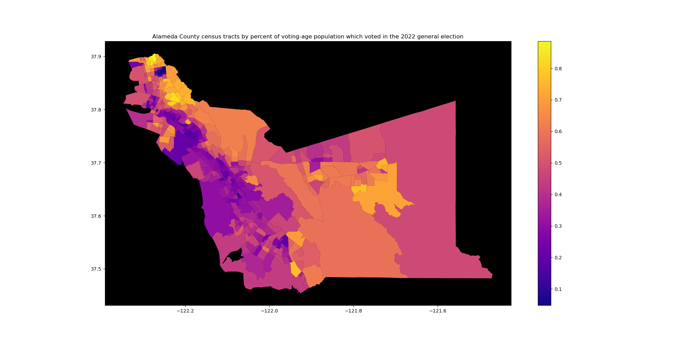

In the affluent, hillside suburbs of Berkeley voter turnout is high. More than 80% of the voting-age population, in some census tracts, made it to the polls in the general election of 2022. Such cannot be said for the flatlands of Oakland, Southside Berkeley and much of the bayside neighborhoods of Alameda County.

In more technical language, the correlation coefficient between the percent of white people living in a census tract and the percent of the voting-age population that voted is 0.76. Thus, the correlation coefficient between the percent of nonwhite people living in a census tract and the percent of the voting-age population that voted is -0.76. Census tracts with a voting-age population less than 100 were excluded from analysis. (I promise I will not use the term “technical language” in a proper news article.)

News coverage from across the country in recent years reveals an interest in covering voter suppression, but few Bay Area news outlets have covered voter suppression in their own locales. The Associated Press also reported in May the NAACP had made attempts at increasing voter registration among Black adults. Local News Matters, the nonprofit wing of Bay City News, reported in 2023 that young voters that year were registering at lower rates than they did in 2021. 

In 2022, the NAACP asked the Alameda County Registrar of Voters to recount the votes from the mayoral election in Oakland. According to CBS News Bay Area, the registrar charged the organization $21,000 for each day the registrar recounted the votes; the NAACP called it voter suppression.

While a number of voices around the nation and in the Bay Area have paid attention to voter suppression, few news organizations have taken on the task of examining how voter suppression may occur in their own communities. Data from the Census Bureau and Berkeley Law could illuminate or clarify residents’ concerns about voter suppression, but with a local angle.

However, this preliminary leaves much to be discovered. Further analysis may investigate the correlation between the voting population and socioeconomic status in Alameda County census tracts. Moreover, this analysis could easily be extended to the entire 18-county Bay Area covered by Bay City News or even the entire state of California.

While this analysis had originally planned to use the census block as a unit of analysis, there were about 700 census blocks of Alameda County’s approximately 18,500 for which there were no residents or the number of voters exceeded the number of voting-age residents, as recorded by the 2022 American Community Survey. Another avenue of exploration could use data from the 2020 decennial census, which are potentially more accurate, and compare them to voter turnout rates from the 2020 general election.

Finally, time series analysis of voter turnout across general elections may also reveal trends with respect to demographic groups’ voting trends over time. 
